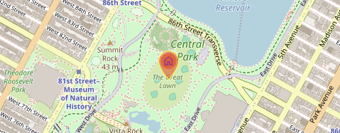

# Leaflet.SymbolsOutlinedMaterial
Just another shameless copy of Leaflet.Awesome-Markers and Leaflet.IconMaterial, but this time with [Material Symbols Outlined](https://fonts.google.com/icons?icon.set=Material+Symbols&icon.style=Outlined) icons and customizable `fill` and `outline` colors of the marker.



## Usage demo
In this repository you can find a demo file called [`demo.html`](demo.html). Just open it in your browser to see how it works.

## Using the plugin
1. Include Material Symbols Outlined web font in your application. See [Google's Guide](https://developers.google.com/fonts/docs/material_symbols) to learn many ways of doing it. But most likely you will end up with something like that in the `<head>` of your HTML:
```html
<link rel="stylesheet" href="https://fonts.googleapis.com/css2?family=Material+Symbols+Outlined" />
```

2. Next, include `Leaflet.SymbolsOutlinedMaterial`'s JavaScript and CSS:

```html
<link href="leaflet.symbols-outlined-material.css" rel="stylesheet">
<script src="leaflet.symbols-outlined-material.js"></script>
```
2. Or use jsDelivr as a CDN for the JavaScript and CSS files:

```html
<link rel="stylesheet" href="https://cdn.jsdelivr.net/gh/NerdTech-aut/Leaflet.SymbolsOutlinedMaterial@refs/heads/master/dist/leaflet.symbols-outlined-material.css">
<script src="https://cdn.jsdelivr.net/gh/NerdTech-aut/Leaflet.SymbolsOutlinedMaterial@refs/heads/master/dist/leaflet.symbols-outlined-material.js"></script>
```

3. Create a Material icon and add it to your Leaflet map
```js
  // Create a semi-transparent home icon
  var homeIcon = L.SymbolsOutlinedMaterial.icon({
    icon: 'home',                         // Name of Material icon
    iconColor: '#aa2187',                 // Material icon color (could be rgba, hex, html name...)
    markerColor: 'rgba(255,0,0,0.5)',   // Marker fill color
    outlineColor: 'yellow',               // Marker outline color
    outlineWidth: 1,                      // Marker outline width
    iconSize: [31, 42]                    // Width and height of the icon
  })
  
  // Attach the icon to the marker and add to the map
  L.marker([40.781399746892205, -73.9665221778159], {icon: homeIcon}).addTo(map)
```

## Credits
1. Adaptation of [Leaflet.IconMaterial](https://github.com/ilyankou/Leaflet.IconMaterial) by [@ilyankou](https://github.com/ilyankou) - MIT License for use with Material Symbols Outlined
2. Shamelessly adapted from [Leaflet.AwesomeMarkers](https://github.com/lvoogdt/Leaflet.awesome-markers) by @[lennardv2](https://github.com/lennardv2/Leaflet.awesome-markers) - MIT License
3. SVG and other magic by [@wesleyvandevoorde](https://github.com/wesleyvandevoorde) from a [never merged pull request](https://github.com/lvoogdt/Leaflet.awesome-markers/pull/74)
4. [Material Symbols Outlined](https://fonts.google.com/icons?icon.set=Material+Symbols&icon.style=Outlined) by Google - Apache-2.0 license.
